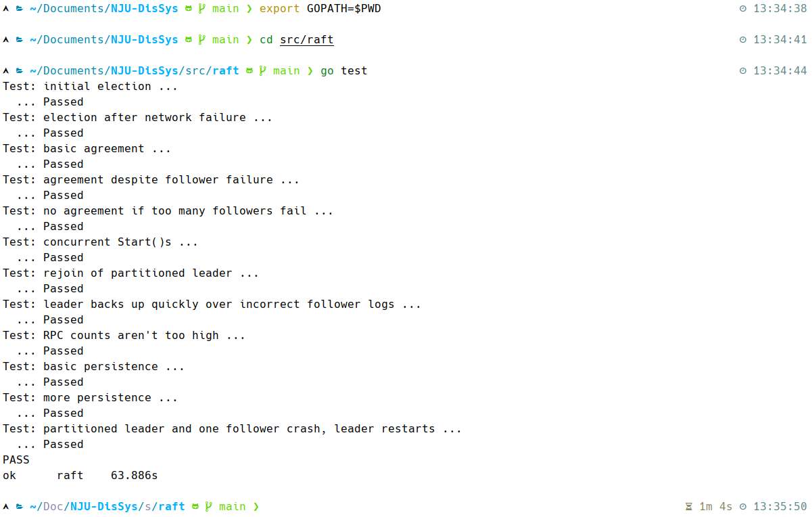

# NJU-DisSys

南京大学分布式系统Raft算法，本项目力求最简洁和最直观的实现。

代码将在实验截止后开源，README已经给出大致框架。

## 运行说明



## 数据结构

`Raft`结构在论文基础上添加了如下成员：

```go
type Raft struct {
    // ...
    status int
    timer  *time.Timer
}
```

其他结构与论文描述一致。

一些常量和随机时间函数：

```go
const (
    FOLLOWER  int = 0
    CANDIDATE int = 1
    LEADER    int = 2
)

const (
    electionTimeoutMin = 300 * time.Millisecond
    electionTimeoutMax = 600 * time.Millisecond
    heartbeatTimeout   = 50 * time.Millisecond
    checkTimeout       = 5 * time.Millisecond
)

func randTime() time.Duration {
    diff := (electionTimeoutMax - electionTimeoutMin).Milliseconds()
    return electionTimeoutMin + time.Duration(rand.Intn(int(diff)))*time.Millisecond
}
```

## 模块设计

Raft算法包含两种RPC，本项目将两种处理流程尽可能统一。

定义`RPC`（具体是`RequestVote`或`AppendEntries`）相关结构：

```go
type RPCArgs struct {
    // Your data here.
}

type RPCReply struct {
    // Your data here.
}
```

接收者响应逻辑：

```go
func (rf *Raft) RPC(args RPCArgs, reply *RPCReply) {
    // Your code here.
}
```

发送者单次请求逻辑，包含可以**立即处理响应**的部分逻辑，通过`channel`发送**顺利**信号（在不同语境下顺利的语义不同，对于`RequestVote`是获得投票，对于`AppendEntries`是得到响应）：

```go
func (rf *Raft) sendRPC(server int, args RPCArgs, reply *RPCReply, ch chan bool) {
    if !rf.peers[server].Call("Raft.RPC", args, reply) {
        return
    }
    // handle the response immediately
    // e.g. convert to follower if outdated
    // or update the leader's nextIndex
    // if reply goes well, then execute ch <- true
}
```

发送者批量请求逻辑，等待所有发收顺利或者超时（`select`中的`break`只能跳出`select`而非`loop`，因此设法把`break`写进`loop`里），之后处理**剩余**事务：

```go
ch := make(chan bool)
for i := 0; i < n; i++ {
    if i != rf.me {
        // construct args and reply
        go rf.sendRPC(i, args, &reply, ch)
    }
}

// wait all goroutines go well or time out
for i := 0; i < n; i++ {
    if i != rf.me {
        select {
        case <-time.After(checkTimeout):
        case <-ch:
            continue
        }
        break // only execute after time out
    }
}

// handle the remaining transactions
// e.g. decide whether to become a leader
// or find the appropriate index to submit
```

在`Make()`函数中无限循环的`goroutine`：

```go
go func() {
    for {
        switch rf.status {
        case FOLLOWER:
            select {
            case <-time.After(checkTimeout):
            case <-rf.timer.C:
                // become candidate
            }
        case CANDIDATE:
            select {
            case <-time.After(checkTimeout):
            case <-rf.timer.C:
                // run for election
            }
        case LEADER:
            select {
            case <-time.After(checkTimeout):
            case <-rf.timer.C:
                // manage log replication
            }
        }
    }
}()
```


